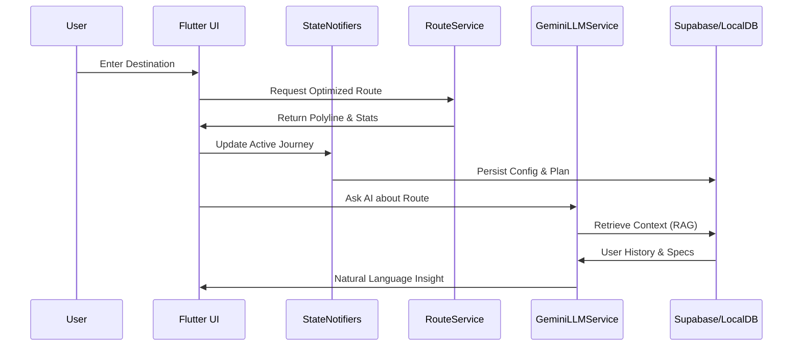

# Haribon Technical Architecture

This document provides a deep-dive into the internal systems and architectural patterns used in the Haribon Smart Road Assistant.

---

## 1. High-Level System Overview

Haribon follows a **Layered Clean Architecture** combined with a **Reactive State Management** pattern. It is designed to be offline-first for core features while leveraging cloud services for intelligence and data synchronization.

### Data Flow Diagram

---

## 2. Intelligence Layer (The RAG Pipeline)

The **Retrieval-Augmented Generation (RAG)** system is the core of Haribon's "Smart" capabilities.

### Ingestion Component
- **Process**: Every trip completed by the user is serialized into a context-string.
- **Storage**: Currently stored in Supabase/SQFlite as a "log" which is then fed into the LLM context window.
- **Privacy**: On-device models (Qwen 3B) are used when the user is offline or requests "Privacy Mode".

### Cloud Inference
- **Service**: `GeminiLLMService`
- **Model**: `gemini-3.1-flash-lite-preview`
- **Output**: JSON-formatted insights including budget alerts and refueling tips.

---

## 3. Real-Time Telemetry Engine

The telemetry engine calculates driving metrics every time a journey state changes.

- **Fuel Consumption**: `Total Distance (KM) / KM/L (Vehicle Config)`
- **Cost Calculation**: `Fuel Consumed (L) * Live Market Price (P/L)`
- **CO2 Impact**: 
    - Gasoline: `Liters * 2.31 kg/L`
    - Diesel: `Liters * 2.68 kg/L`

---

## 4. Geographic & Mapping Services

Haribon uses a hybrid approach to geographic data:

| Service | Provider | Purpose |
| :--- | :--- | :--- |
| **Routing** | OSRM / OpenStreetMap | Real-world road-snapped polylines. |
| **Geocoding** | Nominatim (OSM) | Name-to-coordinate search. |
| **Toll Logic** | Custom Expressway API | Predicts toll costs based on highway entries/exits. |
| **Map Rendering** | Flutter Map | Interactive vector/tile display. |

---

## 5. Reactivity & State Management

Haribon uses `ConfigNotifier` and `DatabaseService` to ensure the UI is always in sync with the underlying data.

- **Global Updates**: When a user changes their vehicle in the "Vehicle Intelligence" screen, a global listener triggers a re-fetch of all telemetry metrics on the "Home Screen".
- **Stream-Based Journey**: The `JourneyService` provides a `Stream<JourneyState>` which allows the map and HUD to update smoothly at 60fps during an active trip.

---

## 6. Security & Environment

- **Encapsulation**: All sensitive API keys are managed via `flutter_dotenv`.
- **Backend**: Supabase provides RLS (Row Level Security) to ensure users can only access their own trip logs.
- **Network**: Integrated proxy rotation prevents CORS blocking in web environments.
