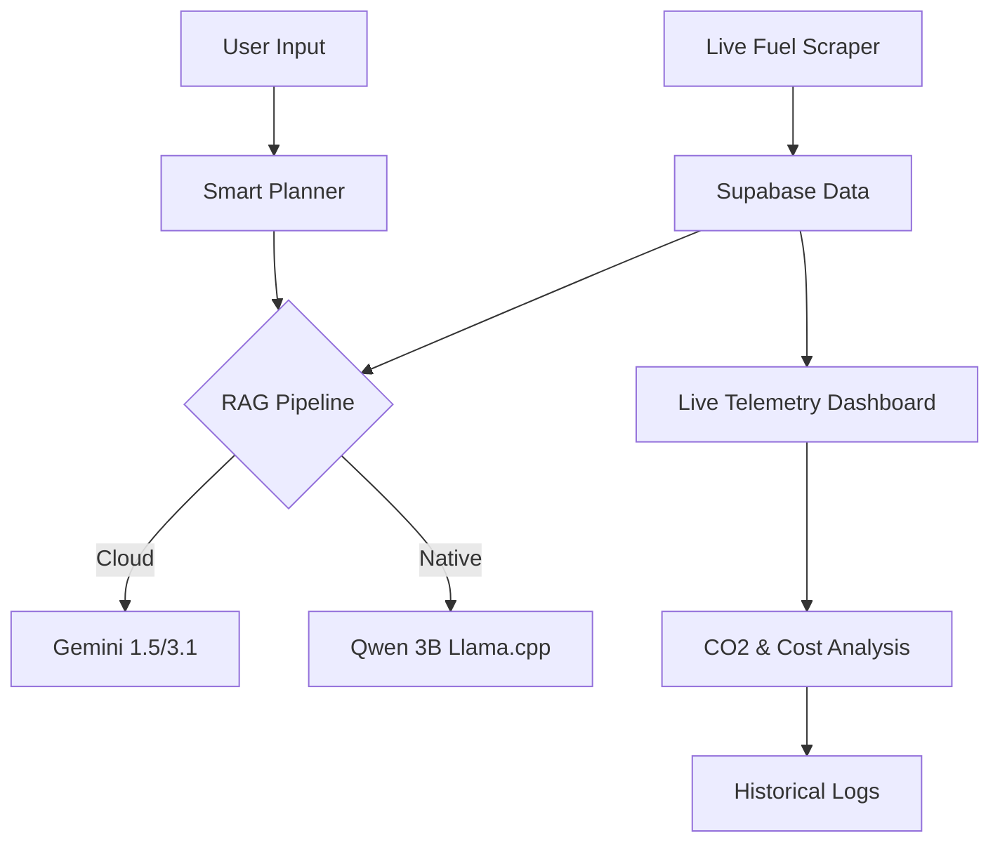

# 🦅 Haribon: Smart Road Assistant

> **“Plan every kilometer—fuel, cost, stops, and impact.”**

Haribon is a production-grade, highly reactive roadtrip assistant built with **Flutter**. It combines real-world vehicle efficiency data, real-time market fuel prices, and cutting-edge **Hybrid RAG AI** to help travelers optimize their journeys for cost, time, and environmental sustainability.

---

## 🚀 Vision & Value Proposition

Haribon (named after the Great Philippine Eagle) represents strength, precision, and a bird's-eye view of your travels. In an era of fluctuating fuel prices and environmental concerns, Haribon empowers drivers to:
- **Save Money**: Find the cheapest fuel along their route using live market data.
- **Reduce Footprint**: Track and optimize CO2 emissions per kilometer.
- **Drive Smarter**: Leverage AI that learns from your driving history and vehicle specs.

---

## 🗺️ Feature Deep-Dive

### 1. Smart Trip Planner & Navigation
Orchestrate your route with industrial-grade precision.
- **On-Road Routing**: Integrated with **OSRM (Open Source Routing Machine)** for high-performance, real-world road pathfinding.
- **Highway vs. Service Road**: Toggle between fastest routes (expressways) and toll-free service roads.
- **Dynamic Camera Fitting**: Intelligent map viewport adjustment ensuring your entire journey is visible at a glance.
- **Road-Snapped Markers**: Custom premium pins anchored precisely to road coordinates, avoiding "floating" markers.

### 2. Live Telemetry Pipeline
Real-time computation of your trip's vital signs.
- **Reactive Fuel Calculation**: Automated calculation of fuel consumption (Liters/KM) based on the active vehicle profile.
- **CO2 Tracking**: Live monitoring of carbon emissions based on fuel grade (Diesel vs. Gasoline).
- **Market Price Integration**: Fetches real-time fuel prices from Supabase to provide accurate "Est. Fuel Cost" metrics.

### 3. Hybrid RAG AI Assistant (Cloud & Native)
A sophisticated AI that "remembers" your vehicle and trip history, designed for both connectivity and total privacy.
- **Offline-First Intelligence**: On mobile devices, Haribon runs a native **Qwen2.5 3B** LLM directly on your hardware using `llama_cpp_dart`. No internet is required for core AI reasoning.
- **Local Geographic Datasets**: Includes a specialized local dataset of Philippine landmarks and coordinates, ensuring the "Smart Planner" works even in remote areas with zero data coverage.
- **Cloud Power**: Seamlessly switches to **Gemini 3.1 Flash Lite Preview** when online for enhanced high-speed cloud reasoning.
- **Retrieval Augmented Generation (RAG)**: Uses a vector-ready pipeline to retrieve historical trip context before answering user queries, making the AI unique to your driving style.

### 4. Vehicle Intelligence Center
Manage and compare your fleet's efficiency.
- **Fleet Management**: Store and switch between multiple vehicle configurations.
- **Efficiency Benchmarking**: Uses a curated dataset of **3,000+ vehicles** to determine base KM/L metrics.
- **Smart Budgeting**: Set trip budgets and get AI alerts if your planned route exceeds your financial limits.

### 5. Journey Logs & Analytics
A comprehensive historical record of your mobility.
- **Past Plan Archive**: A sleek, card-based history of all recorded journeys.
- **Logistics Timeline**: An interactive vertical timeline showing every stop, refueling event, and milestone.
- **Performance Scores**: Automated "Efficiency Scores" (0-100) based on your budget compliance and fuel optimization.

---

## 🛠️ Advanced Tech Stack

### Frontend & Core
- **Framework**: [Flutter](https://flutter.dev/) (3.11.5+) - Cross-platform performance.
- **Language**: [Dart](https://dart.dev/) - Reactive and robust.
- **State Management**: [ChangeNotifier](https://api.flutter.dev/flutter/foundation/ChangeNotifier-class.html) + [ValueNotifier] - Clean and reactive data flow.

### Backend & Data
- **Database**: [Supabase](https://supabase.com/) - Real-time cloud synchronization and Auth.
- **Local Cache**: [SQFlite](https://pub.dev/packages/sqflite) - Persistent local storage for offline readiness.
- **Proxy Layer**: Robust multi-proxy rotation (`allorigins`, `corsproxy`, `codetabs`) for reliable Web API access.

### Native & Offline Architecture
- **Edge Inference**: [llama_cpp_dart](https://pub.dev/packages/llama_cpp_dart) - Powering on-device Qwen2.5 3B models.
- **Offline Persistence**: [SQFlite](https://pub.dev/packages/sqflite) - Full trip planning and history access without server dependency.
- **Local Geocoding**: Embedded dataset of thousands of points of interest for reliable offline coordinate lookup.

---

## 🏗️ System Architecture



---

## 👥 Devkada Team

| Name | Role | Focus |
| :--- | :--- | :--- |
| **Arron Kian Parejas** | AI/ML & Full-Stack | RAG Pipelines, Supabase Integration, Telemetry Logic |
| **Aaron Matthew Francisco**| Frontend & UI/UX | Map Visualization, Component Architecture |
| **Adrian Kyle Mariano** | Frontend & Design | Responsive Layouts, Asset Management |
| **Lauren Kailey Francisco** | UI/UX & Content | User Journeys, Branding, Video Direction |

---

## 🏁 Getting Started

1. **Clone & Install**:
   ```bash
   git clone https://github.com/your-repo/haribon.git
   cd haribon
   flutter pub get
   ```

2. **Environment Setup**:
   Create a `.env` file in the root directory:
   ```env
   GEMINI_API_KEY=your_gemini_key_here
   SUPABASE_URL=your_supabase_url
   SUPABASE_ANON_KEY=your_supabase_anon_key
   ```

3. **Launch**:
   ```bash
   flutter run -d chrome # For Web
   flutter run # For Mobile
   ```

---
*Built with ❤️ for the future of smart mobility by Devkada.*
